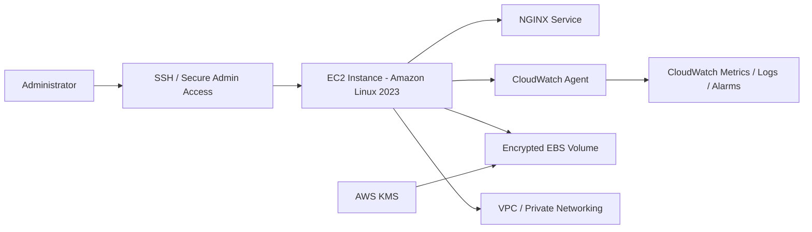

# AWS Cloud Functionality Report

## Overview

This repository documents a hands-on AWS lab design for a secure and functional cloud server environment built for a fictional fintech organization. The goal was to stand up a practical AWS-based virtual machine environment with secure storage, Linux administration, baseline monitoring, and network planning suitable for a small web-service workload.

## Business Problem

The organization needed a cloud-hosted virtual machine that could support:

- a lightweight server workload in AWS
- secure storage for operating system and application files
- Linux-based administration and package management
- centralized monitoring and log collection
- network design decisions appropriate for a security-conscious environment

The project asked a practical question: **How should a secure EC2-based Linux server be configured for cloud functionality, monitoring, and storage protection?**

## Architecture Summary

### AWS services and components used

- **Amazon EC2** for the virtual machine
- **Amazon Linux 2023** as the guest operating system
- **Amazon EBS** for VM storage
- **AWS KMS** for volume encryption
- **Amazon VPC** for network isolation and private addressing
- **Amazon CloudWatch + CloudWatch Agent** for monitoring and log collection
- **NGINX** for web service functionality
- **sshd** for secure remote administration

### Recommended configuration

- EC2 instance type: **t3.medium**
- Operating system: **Amazon Linux 2023**
- Storage: **encrypted EBS volumes**
- Network approach: **static private IPs for critical systems; avoid direct public IPs for production workloads when possible**
- Monitoring approach: **CloudWatch Agent for metrics and logs**

## Security Decisions

Key security decisions in the project include:

- enable **EBS encryption by default** where possible
- prefer **customer-managed KMS keys** in production for stronger access and audit control
- use **private IP addressing** for critical servers
- avoid exposing production servers directly to the internet when a load balancer or controlled entry point is available
- limit enabled services to those required for the server role
- collect operating system, authentication, and web server logs centrally
- use least-privilege access patterns for administration and service permissions

## Monitoring and Observability

The monitoring plan centers on CloudWatch and the CloudWatch Agent.

Primary signals defined in the project include:

- CPU utilization
- memory usage
- disk usage
- network in/out
- EC2 status checks
- `/var/log/messages`
- `/var/log/secure`
- NGINX access and error logs

This makes the environment easier to troubleshoot and helps create a baseline for alerting and operational review.

## Tradeoffs

### t3.medium as a starting point

Using a `t3.medium` is cost-effective and appropriate for a small demonstration workload, but it is not a production-scale financial-services platform. If traffic or transaction volume grows, horizontal or vertical scaling would be required.

### Amazon Linux 2023

Amazon Linux 2023 is a strong AWS-native choice with modern packaging, cloud alignment, and no added license cost. The tradeoff is that package availability and operational familiarity may differ from other enterprise Linux distributions.

### Default AWS-managed key vs. customer-managed key

Using the default `aws/ebs` key is convenient in a lab. Customer-managed KMS keys provide better control, rotation policy options, and more explicit access governance in real environments.

### Private networking vs. simplicity

Keeping critical systems on private IPs improves security posture, but it can make access paths and troubleshooting more complex if supporting infrastructure is not planned well.

## Implementation Notes

This repo should be treated as a **sanitized portfolio case study**, not as a full production blueprint.

Items that remain **unspecified** in the original materials include:

- full subnet layout and CIDR ranges
- actual security group rules
- IAM role and policy JSON
- load balancer/WAF integration details
- backup schedules
- patching automation
- exact alarm thresholds
- production-grade HA design

If you expand this repo later, strong additions would include:

- a sample CloudWatch Agent config file
- user-data/bootstrap notes for Amazon Linux 2023
- a security group diagram
- a sample alarm matrix
- a screenshot of the EC2/EBS/CloudWatch relationship

## Lessons Learned

- encryption, monitoring, and network isolation should be part of the first build, not late-stage add-ons
- a clean Linux administration story is a strong cloud engineering signal, especially when it includes package management, services, logging, and troubleshooting
- even a small EC2 project becomes much more compelling when the README explains design tradeoffs instead of only configuration steps
- production readiness is not just about “launching an instance”; it is about repeatability, isolation, observability, and least-privilege access
