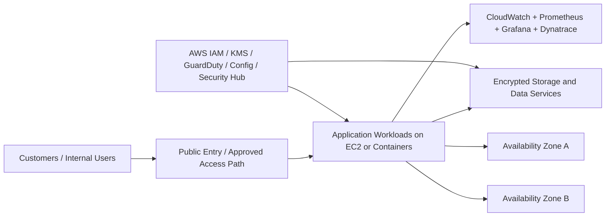

# AWS IaaS Migration Assessment

## Overview

This repository summarizes a cloud migration case study for a fictional fintech organization modernizing from traditional infrastructure to AWS Infrastructure as a Service. The goal was to improve customer experience, support high-volume real-time transactions, strengthen analytics readiness, preserve security and compliance expectations, and create a scalable migration path that would not require a risky full rebuild on day one.

## Business Problem

The company needed an infrastructure strategy that could support:

- highly available digital financial services
- secure handling of sensitive customer and transaction data
- better scalability during traffic spikes
- compatibility with legacy applications and operational processes
- centralized monitoring, logging, and compliance visibility
- phased migration with reduced operational risk

The project focused on the question: **Which IaaS platform provides the best balance of security, scalability, compatibility, reliability, and operational efficiency for a financial-services modernization effort?**

## Recommended Architecture

The recommended target state uses AWS as the preferred IaaS platform.

### Core AWS building blocks

- **Amazon EC2** for virtualized application and service workloads
- **Amazon EBS** for block storage
- **AWS KMS** for encryption key management
- **Amazon VPC** for network isolation and segmented application placement
- **Security Groups and routing controls** for software-defined network boundaries
- **AWS IAM** for access control and role-based administration
- **Amazon CloudWatch / CloudTrail / Config / Security Hub / GuardDuty** for operational visibility, auditability, and security posture
- **Elastic Load Balancing / Auto Scaling / Amazon EKS** as candidate scaling layers in the target architecture
- **Prometheus, Grafana, and Dynatrace** as observability tools for metrics, dashboards, troubleshooting, and application performance analysis

### Architecture shape

The migration plan assumes a secure AWS landing zone with separate environments for:

- production
- development
- testing
- logging
- security operations

It also assumes multi-Availability Zone placement for resilience and a phased workload migration sequence rather than a single cutover event.

## Proposed Flow

## Security Decisions

Key security decisions in the design include:

- encrypt sensitive data at rest and in transit
- apply least-privilege access controls
- isolate customer-facing and internal systems through network segmentation
- centralize logging, auditability, and security monitoring
- treat hybrid connectors and identity flows as high-risk boundaries
- support backup, snapshots, and business continuity planning

## Tradeoffs

### Why AWS was selected

AWS was recommended because it offered the broadest combination of cloud maturity, financial-services alignment, geographic resilience, security tooling, and gradual migration compatibility.

### Main tradeoffs considered

- **IaaS flexibility vs. operational complexity**  
  IaaS offers control and compatibility, but it places more responsibility on the engineering team than a higher-level managed platform.

- **Phased migration vs. speed**  
  A phased approach reduces migration risk and protects business continuity, but modernization can take longer.

- **Deep observability vs. tool overhead**  
  Combining CloudWatch, Prometheus, Grafana, and Dynatrace improves visibility, but it also increases operational complexity and tuning effort.

- **Compatibility-first migration vs. greenfield rebuild**  
  Preserving compatibility with legacy systems lowers disruption, but it may delay deeper architectural simplification.

## Implementation Notes

This project is an architecture and migration assessment, not a production deployment.

Items that were **unspecified** in the original scenario and should be treated as future design work include:

- exact database engines and schemas
- cost model and budget thresholds
- subnet CIDRs and detailed route design
- RTO/RPO targets
- full IAM policy JSON
- final workload split between EC2 and Kubernetes
- final CI/CD implementation details

If this repo is expanded later, good next artifacts would include:

- a landing-zone folder structure
- Terraform or CloudFormation stubs
- sample IAM role policies
- sample monitoring dashboard screenshots
- a migration-wave spreadsheet or markdown tracker

## Lessons Learned

- cloud migration decisions are strongest when framed around security, reliability, compatibility, and observability together rather than in isolation
- virtualization and elasticity solve only part of the problem; governance and visibility matter just as much
- phased migrations are often the most realistic path for regulated or legacy-heavy environments
- architecture reviews become much stronger when they explicitly document tradeoffs and unknowns
