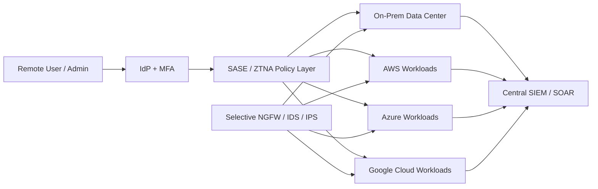

# Hybrid Security Architecture

## Overview

This repository summarizes a hybrid and multicloud security architecture proposal created for a fictional post-merger retail environment. The scenario combines an on-premises data center with workloads across AWS, Azure, and Google Cloud. The project focuses on how to secure data movement, preserve visibility across trust boundaries, and reduce policy drift in a complex environment.

## Business Problem

After a merger, the organization needed a security architecture that could:

- protect sensitive customer and retail data moving between on-prem and cloud environments
- support remote users and administrators without broad network exposure
- centralize visibility and monitoring across multiple clouds and on-prem systems
- preserve business continuity during integration
- scale without multiplying blind spots and operational overhead

The core design challenge was: **How do you secure hybrid and multicloud traffic while preserving centralized detection, investigation, and response?**

## Recommended Architecture

The recommended design uses **SASE + ZTNA as the primary control plane**, with selective **NGFW/IDS/IPS** retained for defense-in-depth and legacy exception paths.

### Architectural components

- **Identity provider + MFA** for strong authentication
- **SASE / SD-WAN** for managed connectivity and policy enforcement
- **ZTNA** for least-privilege, application-level access
- **Selective NGFW / IDS / IPS** at hybrid boundaries
- **Security zones and segmentation rules** for trust-boundary control
- **Central SIEM / SOAR** for telemetry correlation and response workflows
- **Cloud IAM / RBAC patterns** in each cloud environment
- **On-prem perimeter controls** for legacy and fallback paths

### Environment scope

- on-premises data center
- AWS workloads
- Azure workloads
- Google Cloud workloads
- remote users and administrators
- centralized SOC visibility

## Security Decisions

The proposal centers on several security decisions:

- enforce **identity-centric access** instead of broad network access
- require **MFA** and context-aware access decisions
- use **default-deny segmentation** between security zones
- minimize and govern hybrid connectors as high-risk interfaces
- centralize telemetry from access, network, cloud, and application layers
- operationalize response through **SIEM/SOAR**
- preserve **defense in depth** through selective boundary inspection controls
- apply **least privilege** consistently across users, admins, and workloads

## Tradeoffs

### Why SASE + ZTNA was recommended

SASE + ZTNA was recommended because the biggest risk in hybrid/multicloud environments is fragmented policy enforcement and inconsistent visibility. Centralizing access policy and telemetry improves governance and makes incident response more coherent across environments.

### Main tradeoffs considered

- **SASE consistency vs. vendor dependency**  
  Centralization improves policy consistency, but it increases dependence on provider performance and availability.

- **NGFW/IDS depth vs. operational overhead**  
  Deep boundary inspection is useful, but reproducing it across multiple clouds adds complexity, tuning effort, and a higher risk of policy drift.

- **Identity-centric access vs. legacy compatibility**  
  Modern zero-trust access patterns are stronger, but some legacy applications require exceptions and careful traffic steering.

- **Central telemetry vs. data volume/noise**  
  Better visibility is valuable only if detections are tuned and operational workflows are mature enough to avoid alert fatigue.

## Implementation Notes

This project is a conceptual architecture proposal.

The following details were **unspecified** and should be treated as future implementation work:

- exact SASE vendor and point-of-presence layout
- exact firewall vendors or SKUs
- detailed cloud-native service mapping for Azure and Google Cloud
- log retention schedules
- SIEM content engineering specifics
- incident-response runbooks and playbooks
- cost model and HA topology per provider

If you expand this repo later, useful additions would include:

- a security-zones diagram
- a hybrid connector inventory template
- a sample log-source matrix
- an access review checklist
- a markdown table comparing “primary path” vs. “legacy exception path”

## Lessons Learned

- hybrid security problems are often policy-consistency and visibility problems more than perimeter-only problems
- identity-based access control is easier to govern and explain than broad network-level trust
- centralized telemetry improves response only if ownership, tuning, and change control are also mature
- multicloud security designs become much stronger when they document tradeoffs, dependencies, and future unknowns explicitly instead of pretending precision that is not yet available
